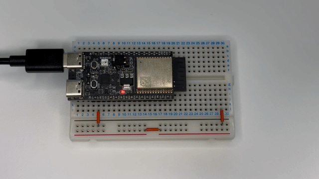

# ex01-led-brink

## Overview

This is a copy of the [LED Blink](https://github.com/apple/swift-matter-examples/tree/main/led-blink) example from the swift-matter-examples repository.



## Circuit Diagram

No connections are required.

## Execution Steps

1. Set the target to ESP32-C6:
   ```bash
   $ idf.py set-target esp32c6
   ```

2. Connect your ESP32 to the PC, build, and flash the application:
   ```bash
   $ idf.py build flash monitor
   ```

3. Observe that the LED on the ESP32-C6 DevKit blinks.
