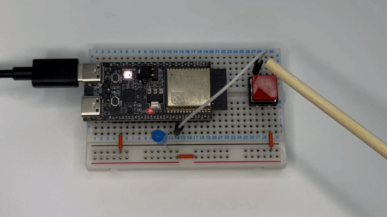
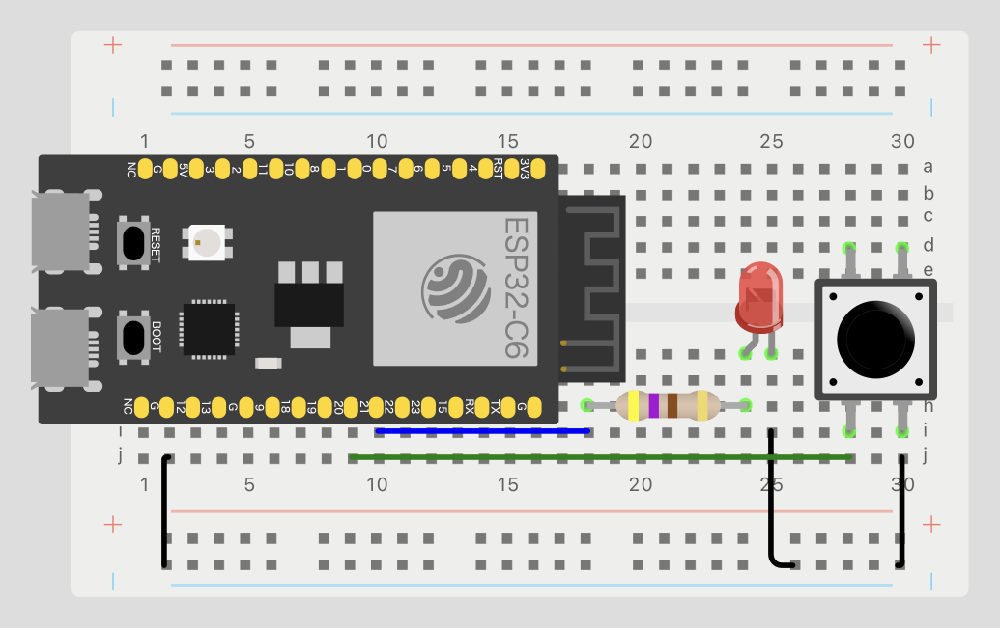

# ex02-digital-io

## Overview

This example uses GPIO digital input and output functionality. When the button is pressed, the LED will blink 5 times.



## Circuit Diagram



## Execution Steps

1. Set the target to ESP32-C6:
   ```bash
   $ idf.py set-target esp32c6
   ```

2. Connect your ESP32 to the PC, build, and flash the application:
   ```bash
   $ idf.py build flash monitor
   ```

3. Press the button connected to GPIO22, and the LED connected to GPIO21 will blink.
