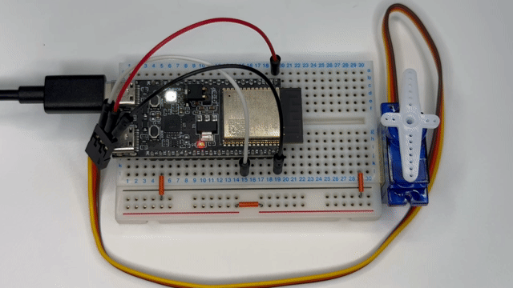
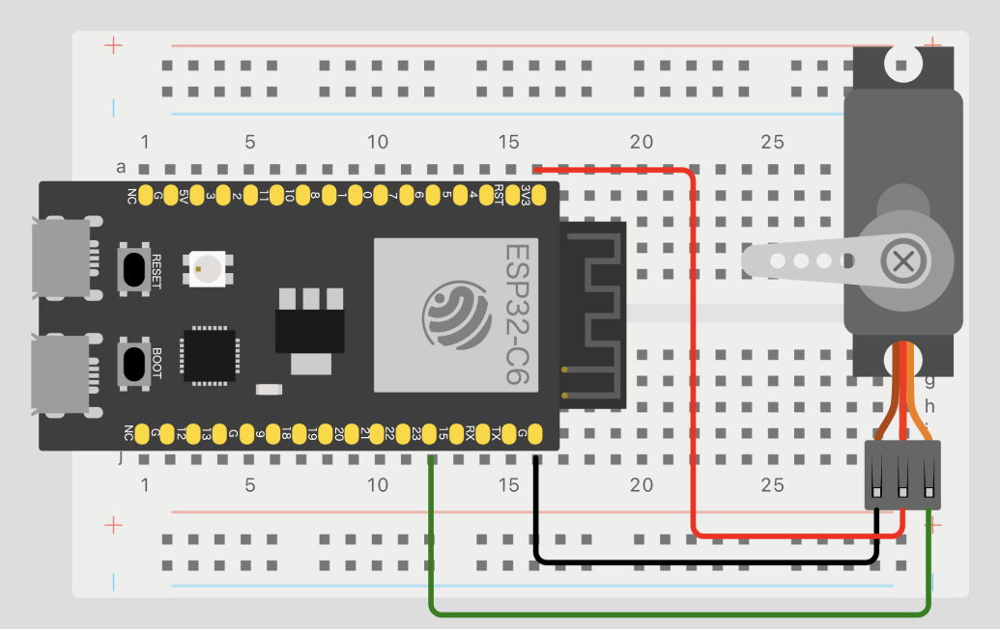

# ex03-pwm-servo

## Overview
This project demonstrates controlling a servo motor using PWM (Pulse Width Modulation). The GIF in the repository was captured using an SG90 servo motor.



## Circuit Diagram


## Steps to Run
1. Set the target to ESP32-C6:
   ```bash
   $ idf.py set-target esp32c6
   ```

2. Connect the ESP32 to your PC, then build and flash the firmware:
   ```bash
   $ idf.py build flash monitor
   ```

3. The servo motor connected to GPIO23 will start moving.
