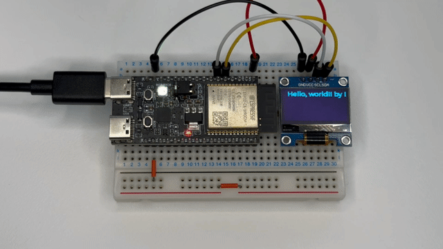
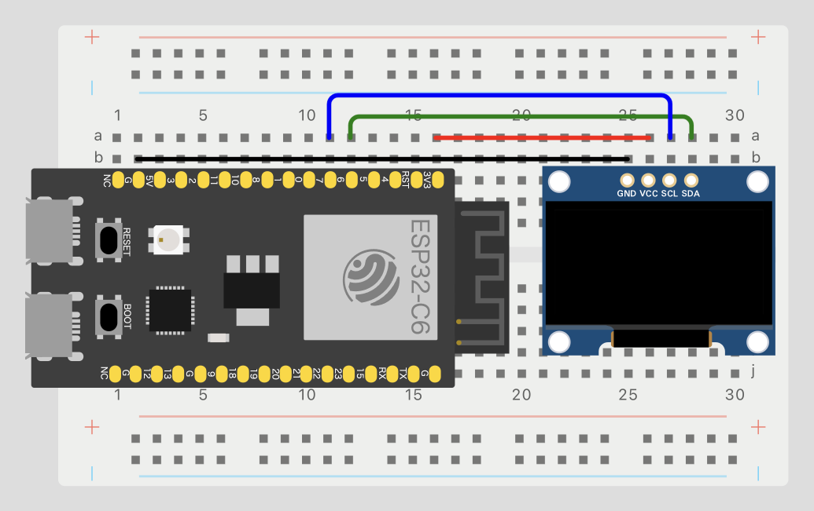

# ex04-i2c-lcd

## Overview
This project controls an I2C LCD driven by an SSD1306 driver. The display will show "Hello, world!! by Embed Swift!" when executed.



## Circuit Diagram


## Steps to Run
1. Set the target to ESP32-C6:
   ```bash
   $ idf.py set-target esp32c6
   ```

2. Connect the ESP32 to your PC, then build and flash the firmware:
   ```bash
   $ idf.py build flash monitor
   ```

3. The LCD connected via I2C will display the message.
